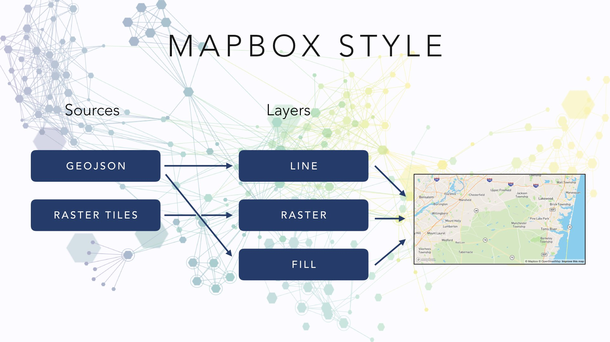
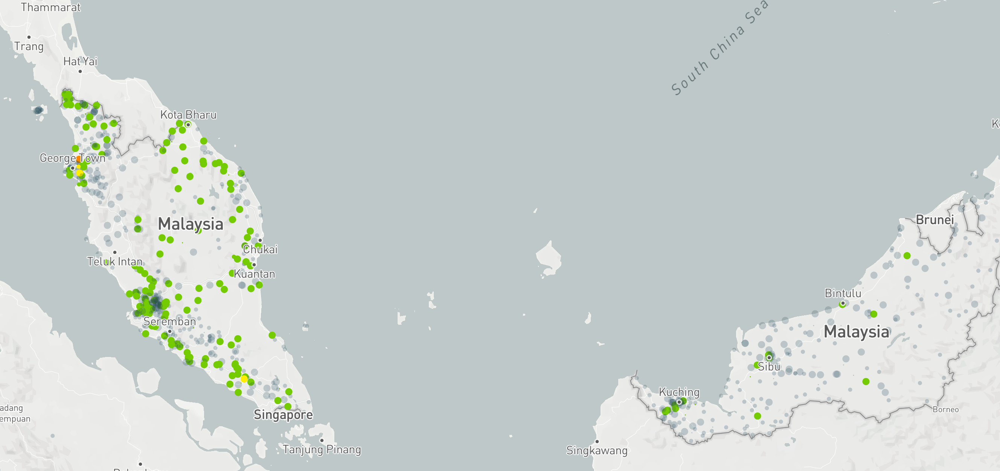
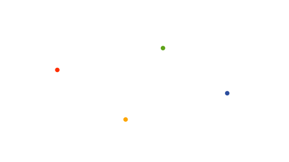
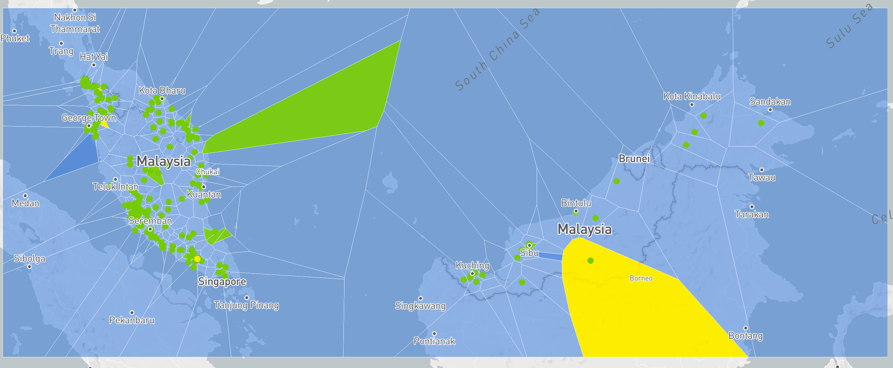
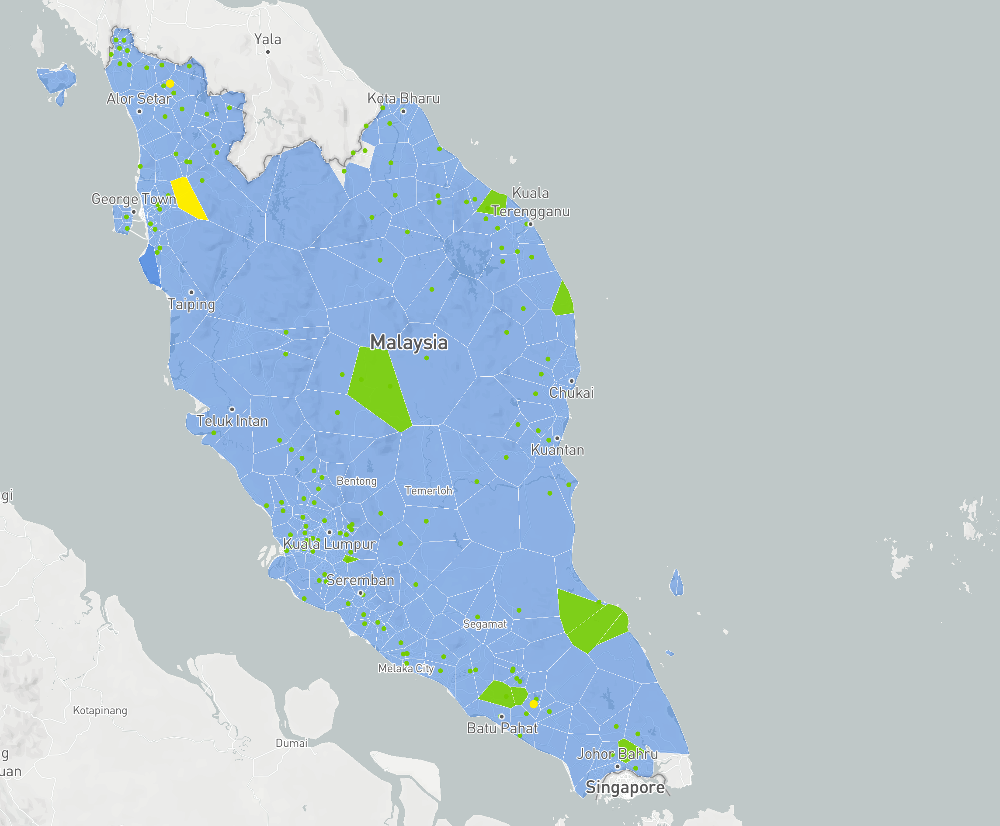

# An introduction to elm-geospatial and elm-mapbox

### By Jakub Hampl

This is an edited version of my Elm Europe 2019 talk. You will be able to see the video soon.

At my work, we deal primarily with satellite data. Turns out, satellite data particularly lends itself to being shown on a map.

And so here I was building mapping applications. The first greenfield project I started working on we decided to use Elm -- for it's many benefits including reliability and refactorability. But when it came time to start building the geographic features of the application, we followed the advice at the time and used ports for that (since then Custom Elements have become a popular alternative). And soon our application reached our MVP goals and we celebrated some success. But as we were building up our application our JavaScript port integration file started to get bigger and messier. Code complexity grew and it seemed to evade good structure leading to something reminiscent of jQuery scripts of old. Worse, our business logic ended up split between the two parts and so the code was organized more on the needs of asynchronous message passing rather than the business logic.

Then, due to external factors, the project was put on hold for about a year. In that time I had a lot of experience building mapping applications with React. But I knew our Elm project was going to be restarted and we would need a good answer to these engineering challenges. And so I started work on building some proper infrastructure for building type safe, reliable, performant and ergonomic maps. I would like to share with you some of the fruits of that labor by introducing two open source packages. One of them, [gampleman/elm-mapbox](https://package.elm-lang.org/packages/gampleman/elm-mapbox/latest/) is designed to render high-quality maps with custom data. The other, **gampleman/elm-geospatial** is designed to be a toolkit for geo-spatial computing. These two tasks are highly related, but one may use the packages independently. For example, many front-end mapping applications don't need to deal with geographical data directly and instead can simply setup the mapping layer to communicate with an appropriate server. As such, andapplication like that only cares about the necessary metadata, but doesn't need to perform geospatial computation. On the other hand, an application may perform geographical querying, but display the results in other ways than by drawing maps.

## Flooding in Malaysia

I think a lot of this may sound quite abstract to many of you, so I will try to show you how you might use some of this with an example. This is a real world example for visualizing data related to flooding in Malaysia. In this project, we wanted to show our users data collected by a number of ground stations that are scattered around the country. There are three types of ground station that are related to flooding: rain stations, water level stations and combined stations. Rain stations are essentially buckets with a hole on the bottom that measure how much water is in them providing a view of how much rain is falling at a particular location. Water level stations are sticks in the river detecting how high the water in a river is. Combined stations perform both of these functions.


In this project we are getting a live data feed from one of our partners. So let's go ahead and visualize this data so that decision makers can evaluate the risk of a flood.

### Divining In

Since elm-mapbox relies on additional JavaScript support (it uses both custom elements and ports), we need to setup our project to support both JavaScript and Elm easily. The simplest way to go about it is to use Parcel, since it supports both modern JS and Elm out of the box with zero configuration.

]

This is the setup code we need to get the JavaScript to communicate with Elm. We've commented out the ports setup, as we won't need it in this project.

```javascript
import { Elm } from "./src/Main.elm";
import { registerCustomElement, registerPorts } from "elm-mapbox";

import "mapbox-gl/dist/mapbox-gl.css";

const token =
    "pk.eyJ1IjoiZm9yZXN0LXByb3RlY3Rvci1nYW1lIiwiYSI6ImNqdnMxMmE4aTBtM3A0YW1zc2gxaDZwMTkifQ.5GqU-G9npYW3UeCxQYrV8g";

registerCustomElement({
    token
});

var app = Elm.Main.init({ flags: {} });
// registerPorts(app);
```

Next, we'll copy the Light style from the gampleman/elm-mapbox repo, and add some small modifications to it to allow us to insert our own custom sources and layers.

Next, we'll create our [Main.elm](src/Example01.elm).

```elm
view : Model -> Html Msg
view model =
    Mapbox.Element.map [] (buildStyle model)


buildStyle : Model -> Style
buildStyle model =
    Map.Style.light
        [ Source.geoJSONFromUrl "flooding" "https://data.easos.my/geoserver/easos-flooding/ows?service=WFS&version=1.0.0&request=GetFeature&typeName=easos-flooding:rainfall_latest&outputFormat=application%2Fjson" [] ]
        [ Layer.circle "points"
            "flooding"
            [ E.getProperty (str "stationtype")
                |> E.matchesStr
                    [ ( "WL", float 1 )
                    , ( "RF", float 3 )
                    , ( "RF & WL", float 5 )
                    ]
                    (float 1)
                |> Layer.circleRadius
            , [ E.getProperty (str "waterlevelmsg"), E.getProperty (str "rainfallmsg") ]
                |> E.coalesce
                |> E.matchesStr
                    [ ( "LIGHT", E.rgba 125 210 33 1 )
                    , ( "NORMAL", E.rgba 125 210 33 1 )
                    , ( "MODERATE", E.rgba 255 239 0 1 )
                    , ( "ALERT", E.rgba 255 239 0 1 )
                    , ( "HEAVY", E.rgba 255 155 0 1 )
                    , ( "WARNING", E.rgba 255 155 0 1 )
                    , ( "VERY HEAVY", E.rgba 255 0 18 1 )
                    , ( "DANGER", E.rgba 255 0 18 1 )
                    , ( "NODATA", E.rgba 49 93 107 0.2 )
                    , ( "OFF", E.rgba 49 93 107 0.2 )
                    ]
                    (E.rgba 49 93 107 0.2)
                |> Layer.circleColor
            ]
        ]
```


Particularly of note is the `buildStyle` function, as this is where most of the action takes place so to say. The map style in mapbox is a bit like the DOM. It's a single data structure that declaratively describes what is going to be rendered on the map. It consists of a bunch of settings, sources and layers. We have the function `light` that describes a pre-built map suitable for data visualization. It accepts additional sources and layers as parameters returning a fully built style.



Sources in Mapbox describe to the map where it should find the data to use for drawing the various shapes on the map. In themselves, sources don't cause anything to show up on the screen. This is done via layers, which describe what visual features the data coming in should have. Layers can also have filters attached to them allowing them to only target some of the data from the source. Hence any source can have a whole bunch of layers attached to it.

So in our case we add a GeoJSON source from a remote URL (which our partners provided us). This is the data we'll be working with for the rest of this example. For now, we can simply hand over the URL to the map and let the map fetch the data on its own. We don't need to worry about it.

Next, we'll create a `circle` layer and give it the ID of our source. A circle layer will show a circle at each point in the data. By default, these will be 5px radius black circles. We can change the color, radius and other visual properties. But even better, we can vary these properties based on the data being rendered. Mapbox supports a serializable expression language that allows us to encode the logic for styling. Let's look at the radius code first. We can fetch the station type property for each point and then call `matchesStr`. You can think of that like a case statement, where we compare the input with a series of options and choose output based on which matches. The last value is the default. We pass this then to the `circleRadius` property. So in this example, we have given water level stations a radius of 1, rain fall stations a radius of 3, and combined stations a radius of 5.

We do a similar trick for the color. However, here we find the first sign of trouble. The logic for figuring out the warning level message for each station is pretty complicated and messy. Here we find the first non-null property and then turn it into a color. This works, but is probably not entirely correct. Also our styling logic starts getting pretty complicated.

[](https://elm-geospatial.netlify.com/example01)
*Click the map to see a live demo*

The good news is we've made our first map visualization!

However, our first attempt leaves a lot to be desired. First of all, the map is a bit of mess of overlapping circles and its hard to get a correct overview of the whole country. We could have high alert circles behind inactive stations and never notice. Second, the two kinds of data - rainfall and river level are hard to tell apart, but they have different characteristics for predicting a flood. Third, we are showing plenty of irrelevant data here -- you don't care about the stations that are off if you're trying to predict a flood. Finally, our code mixes styling logic with logic for dealing with messy data.

### Take 2

Let's make an another attempt to solve these problems. In order to tackle the messiness of our data in a principled way, we're going to use JSON decoders and explicit modeling. Let's first take a look at the [Station module](src/Station.elm):

```elm
module Station exposing (Station(..), decoder, getRainfall, getWaterLevel)

import Json.Decode as Decode exposing (Decoder)
import RainfallStation exposing (RainfallStation)
import WaterLevelStation exposing (WaterLevelStation)


type Station
    = WaterLevel WaterLevelStation
    | Rainfall RainfallStation
    | Combined WaterLevelStation RainfallStation
    | Garbage
```

Here we explicitely model the possible station types, including the possibility that our data may contain incomprehensible garbage. We'll fitler that out later.

```elm
decoder : Decoder Station
decoder =
    Decode.field "stationtype" Decode.string
        |> Decode.andThen
            (\t ->
                case t of
                    "WL" ->
                        Decode.map WaterLevel WaterLevelStation.decoder
                            |> failover

                    "RF" ->
                        Decode.map Rainfall RainfallStation.decoder
                            |> failover

                    "RF & WL" ->
                        Decode.oneOf
                            [ Decode.map2 Combined WaterLevelStation.decoder RainfallStation.decoder
                            , Decode.map WaterLevel WaterLevelStation.decoder
                            , Decode.map Rainfall RainfallStation.decoder
                            , Decode.succeed Garbage
                            ]

                    _ ->
                        Decode.fail "Unexpected type"
            )


failover : Decoder Station -> Decoder Station
failover stationDecoder =
    Decode.oneOf
        [ stationDecoder
        , Decode.succeed Garbage
        ]
```

Next, we've built a JSON decoder, that instead of failing can simply partially succeed.

```elm
getRainfall : Station -> Maybe RainfallStation
getRainfall station =
    case station of
        WaterLevel wl ->
            Nothing

        Rainfall rf ->
            Just rf

        Combined wl rf ->
            Just rf

        Garbage ->
            Nothing


getWaterLevel : Station -> Maybe WaterLevelStation
getWaterLevel station =
    case station of
        WaterLevel wl ->
            Just wl

        Rainfall rf ->
            Nothing

        Combined wl rf ->
            Just wl

        Garbage ->
            Nothing
```

Finally, we include some accessor functions. We'll be using these later with `filterMap`.

Next, we have the [RainfallStation](src/RainfallStation.elm) and [WaterLevelStation](src/WaterLevelStation.elm) modules. They're nearly identical, so we'll focus on RainfallStation:

```elm
module RainfallStation exposing (RainfallStation, Status, decoder, getStatus, source)

import Coordinates exposing (WGS84)
import FeatureCollection exposing (FeatureCollection)
import Json.Decode as Decode exposing (Decoder)
import Json.Encode
import Mapbox.Source exposing (Source)


type RainfallStation
    = Off
    | On Status
```

A station can be turned off, for example most of these are solar powered.

```elm
type Status
    = NoRain
    | Light
    | Moderate
    | Heavy
    | VeryHeavy
```

If it's on it will have a status field indicating how heavy the rain might be.

```elm
getStatus : RainfallStation -> Maybe Status
getStatus rainfallStation =
    case rainfallStation of
        Off ->
            Nothing

        On status ->
            Just status
```

If you squint a bit, the type resembles a `Maybe`, so we're going to make a function to turn it into one (hint: `filterMap` will come in handy later).

```elm
decoder : Decoder RainfallStation
decoder =
    Decode.field "rfstationstatus" Decode.string
        |> Decode.andThen
            (\stationStatus ->
                case stationStatus of
                    "ON" ->
                        Decode.field "rainfallmsg" Decode.string
                            |> Decode.andThen
                                (\msg ->
                                    case msg of
                                        "NODATA" ->
                                            Decode.succeed NoRain

                                        "LIGHT" ->
                                            Decode.succeed Light

                                        "MODERATE" ->
                                            Decode.succeed Moderate

                                        "HEAVY" ->
                                            Decode.succeed Heavy

                                        "VERY HEAVY" ->
                                            Decode.succeed VeryHeavy

                                        _ ->
                                            Decode.fail <| "unknown rf message " ++ msg
                                )
                            |> Decode.map On

                    "OFF" ->
                        Decode.succeed Off

                    _ ->
                        Decode.fail <| "Unkown rf status " ++ stationStatus
            )
```

Then we need a way to decode this - nothing special going on here, just your normal decoder.

```elm
source : String -> FeatureCollection WGS84 Status -> Source
source id collection =
    collection
        |> FeatureCollection.encode encodeStatus
        |> Mapbox.Source.geoJSONFromValue id [ Mapbox.Source.tolerance 0 ]


encodeStatus : Status -> Json.Encode.Value
encodeStatus v =
    Json.Encode.object
        [ ( "status"
          , case v of
                NoRain ->
                    Json.Encode.string "no-rain"

                Light ->
                    Json.Encode.string "light"

                Moderate ->
                    Json.Encode.string "moderate"

                Heavy ->
                    Json.Encode.string "heavy"

                VeryHeavy ->
                    Json.Encode.string "very-heavy"
          )
        ]
```

Finally, we need a way to turn this into a Mapbox source. We're going to use [`Mapbox.Source.geoJSONFromValue`](https://package.elm-lang.org/packages/gampleman/elm-mapbox/latest/Mapbox-Source#geoJSONFromValue) to do that, and for that we need to turn our status into JSON.

### Feature Collection

We some some mentions of a `FeatureCollection` above. This is one of the most important modules in elm-geospatial.

```elm
type alias FeatureCollection coordinates properties =
    List (Feature coordinates properties)
```

A `FeatureCollection` is simple a `List` of `Feature`s. A `Feature` represents a thing in the world, and as such it contains some geometry describing what the thing looks like (say on a map) and where it is. It also has some arbitrary data that your application can use to tell what the thing is. We call this data `properties`. The other type variable, `coordinates` is due to the fact that the earth has a geometrically complex shape and as such there are multiple ways to describe coordinates on the earth (and which of these systems is the most appropriate depends on the use case). In elm-geospatial, the most commonly used coordinate system is encoded in the type `WGS84` - this is basically GPS coordinates. The type system will protect you from accidentally mixing incompatible coordinate systems.

The **FeatureCollection** module includes many useful functions:

```elm
decoder : Decoder a -> Decoder (FeatureCollection WGS84 a)

encode : (a -> Value) -> FeatureCollection WGS84 a -> Value
```

It can help with input and output using decoders and encoders from the GeoJSON format (it has some more advanced versions of these as well).

```elm
map : (a -> b) -> FeatureCollection coord a -> FeatureCollection coord b

filterMap : (a -> Maybe b) -> FeatureCollection coord a -> FeatureCollection coord b
```

It has functions that help you manipulate just your `properties` type, keeping the geometry untouched (interestingly, you can use both `List.map` and `FeatureCollection.map` on `FeatureCollection`s, which have different meanings; as `List.map : (Feature coord1 a -> Feature coord2 b) -> FeatureCollection coord1 a -> FeatureCollection coord2 b` in this case).

```elm
mapCoordinates : (a -> b) -> FeatureCollection a properties -> FeatureCollection b properties
```

On the other hand, the module also has functions to manipulate just the Geometry and leave the `properties` alone.

### Putting it all together

So we've built some useful modules and datastructures, let's put them to good use. ([See the full file](src/Example02.elm))

```elm
getData : Cmd Msg
getData =
    Http.get
        { url = "https://data.easos.my/geoserver/easos-flooding/ows?service=WFS&version=1.0.0&request=GetFeature&typeName=easos-flooding:rainfall_latest&outputFormat=application%2Fjson"
        , expect = Http.expectJson Loaded (FeatureCollection.decoder Station.decoder)
        }


update : Msg -> Model -> ( Model, Cmd Msg )
update msg model =
    case msg of
        Loaded (Ok data) ->
            ( process data, Cmd.none )
```

We're now fetching the data from the same URL, but this time using **elm/http** and piping it into our Station decoder, letting elm-geospatial handle all the geospatial aspects of this. When the data loads, we'll want to process it.

```elm
process : FeatureCollection WGS84 Station -> Model
process data =
    { waterLevel =
        data
            |> FeatureCollection.filterMap Station.getWaterLevel
            |> FeatureCollection.filterMap WaterLevelStation.getStatus
    , rainfall =
        data
            |> FeatureCollection.filterMap Station.getRainfall
            |> FeatureCollection.filterMap RainfallStation.getStatus
    }
```

Here we use `FeatureCollection.filterMap` to get rid of garbage and off stations and split the data into seperate water level and rainfall data sets.

```elm
buildStyle : Model -> Style
buildStyle model =
    Map.Style.light (sources model) layers


sources : Model -> List Source
sources model =
    [ RainfallStation.source "rainfall" model.rainfall
    , WaterLevelStation.source "waterlevel" model.waterLevel
    ]
```

Finally we update `buildStyle` to use our newly built source functions.

### Voronoi Diagrams

Now we would like to do something interesting with the rainfall data. We will want to turn it from points into an area - giving us an understanding what the rain might look like in any part of the country.

Now there is a multitude of ways to do it - from bilinear interpolation, to very clever weather modeling.

However, for this use case we don't want anything clever. We just want to show the status of the nearest station. For this we're going to use a Voronoi diagram.

You will have to excuse a small aside that I would like to make and explain what a Voronoi diagram is. Imagine we have a surface and we put on some points, which we will call sites. Now for every point on the surface, one of three conditions can take place.



1. It is closest to one of the sites. In this case the point will be part of a face of the resulting diagram.
2. It is the closest to exactly two sites. In this case the point will be part of an edge of the resulting diagram.
3. It is closest to three or more sites - it will be a vertex of the resulting diagram.

Once we do this for every point (of which there are infinitely many) on this infinite plane, we have a diagram consisting of a bunch of polygons dividing the plane,
such that everything inside each polygon is closest to the respective site.

Boom! Let's apply that to our map:

```elm
process : FeatureCollection WGS84 Station -> Model
process data =
    { waterLevel =
        data
            |> FeatureCollection.filterMap Station.getWaterLevel
            |> FeatureCollection.filterMap WaterLevelStation.getStatus
    , rainfall =
        data
            |> FeatureCollection.filterMap Station.getRainfall
            |> FeatureCollection.filterMap RainfallStation.getStatus
            |> FeatureCollection.voronoi malaysiaExtent -- Voronoi
    }

malaysiaExtent : BBox
malaysiaExtent =
    BBox.fromExtrema
        { minLng = 98.085756871
        , minLat = -0.633131415201
        , maxLng = 121.181903925
        , maxLat = 8.4805288332
        }
```

We simply call the built in `voronoi` function. We need to pass in a bounding box ("BBox") that will clip the resulting polygons, as they may be infinite otherwise.

[](https://elm-geospatial.netlify.com/example02)
*Click the map to see a live demo*

Well, it looks "interesting". But our users might be under the impression we are showing them abstract art rather than a map.

### Tidying it up

In order to fix that, we will need to turn it back into something that looks like Malaysia. In order to do that, we'll need the shape of Malaysia. For various reasons I won't get into, the shape used in our map isn't really suitable for the task, so we'll download another one and handily decode it just like before. I've omitted the code here, but you can [see it here](src/Example03.elm).


Now we need a way to combine this shape with what we got. We're going to use polygon intersections to do this. Polygon intersections are just like set intersections for polygons - when we intersect two polygons, we get a polygon that both of the inputs covered. We can do that here, and hey presto, we now have a fairly attractive map showing us an estimate of rainfall across the country.

[](https://elm-geospatial.netlify.com/example03)
*Click the map to see a live demo*


We can go further, for example in the prototype I generated a circle with a certain radius from each rainfall station and ran another intersection to limit the problem of making these areas unrealistically big.

Now you can be the judges of whether this is a particularly good way to visualize this particular dataset (and in our case we never ended up shipping this), but I think it illustrates nicely that one can achieve useful results by creatively combining the tools I've been demonstrating.

And so I invite you to dive into the world of web maps and discover this fascinating world on the intersection of front-end engineering, geometry and big data that has the potential to make us understand many of the problems of our world in the ancient human way - by drawing pictures of them.
